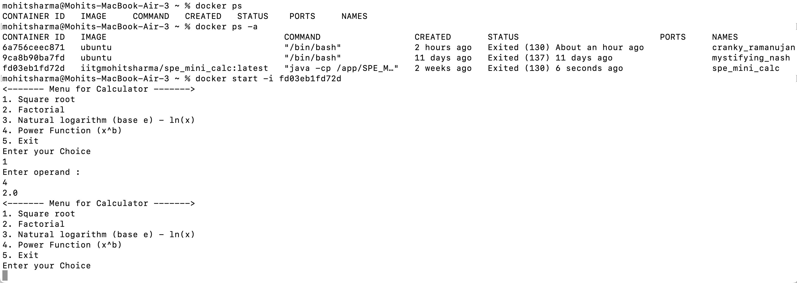
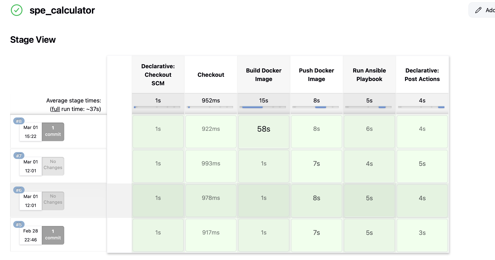

# 🧮 **SPE Mini Calculator**

**SPE Mini Calculator** is a **Spring Boot-based scientific calculator** application with a fully automated **DevOps pipeline**. The project supports various mathematical operations and integrates **Jenkins, Docker, and Ansible** for continuous integration, deployment, and containerization.

---

## 🚀 **Features**
- **Basic Operations:** 
    - Addition  
    - Subtraction   
    - Multiplication  
    - Division:
- **Scientific Operations:**  
    - Square root (√x)  
    - Factorial (x!)  
    - Natural logarithm (ln(x))  
    - Power function (xᵇ).
- **DevOps Pipeline:**  
    - **GitHub:** Source code management.  
    - **Jenkins:** Continuous Integration and Deployment.  
    - **Docker:** Containerization and image creation.  
    - **Ansible:** Configuration management and deployment.  
- **Exception Handling:**  
    - Prevents division by zero with appropriate error messages.  
- **RESTful APIs:**  
    - Exposes operations via HTTP endpoints.  

---

## 🔥 **Tech Stack**
- **Backend:** Spring Boot (Java)  
- **DevOps Tools:** Jenkins, Docker, Ansible  
- **Build Tool:** Maven  
- **Version Control:** GitHub  
- **Container Registry:** Docker Hub  
- **Deployment:** Local machine or Kubernetes cluster  

---

## 📁 **Project Structure**
```
src  
 └── main  
     ├── java  
     │     └── com.example.demo  
     │           ├── controller           # REST API endpoints  
     │           │        └── CalculatorController.java  
     │           ├── service              # Business logic  
     │           │        └── CalculatorService.java  
     │           ├── model                # Data model  
     │           │        └── Operation.java  
     │           └── DemoApplication.java # Main entry point  
     │     
     └── resources  
           ├── static                     # Static assets  
           ├── templates                  # Frontend templates (if any)  
           └── application.properties     # Spring Boot configurations  

pom.xml         # Project dependencies  
Dockerfile      # Docker image configuration  
Jenkinsfile     # Jenkins pipeline script  
ansible-playbook.yml  # Ansible deployment script  
```

---

## ⚙️ **Setup Instructions**

### 🔥 **1. Clone the Repository**
```bash
git clone https://github.com/mohitsharma990/SPE_Mini_Calculator.git
cd SPE_Mini_Calculator
```

### ⚙️ **2. Build the Project**
- Use Maven to build the Spring Boot project:
```bash
mvn clean install
```

### 🛠️ **3. Run the Application**
```bash
mvn spring-boot:run
```
- The application will run on:  
```
http://localhost:8080
```

---

## 🐋 **Docker Integration**

### ✅ **1. Build Docker Image**
```bash
docker build -t spe-mini-calculator .
```

### ✅ **2. Run Docker Container**
```bash
docker run -p 8080:8080 spe-mini-calculator
```

---

## 🚀 **RESTful API Endpoints**

You can test the endpoints using **Postman**, **cURL**, or a browser.

### ➕ **Addition**
```
GET http://localhost:8080/api/add?a=10&b=5  
```

### ➖ **Subtraction**
```
GET http://localhost:8080/api/subtract?a=10&b=5  
```

### ✖️ **Multiplication**
```
GET http://localhost:8080/api/multiply?a=10&b=5  
```

### ➗ **Division**
```
GET http://localhost:8080/api/divide?a=10&b=5  
```

### √ **Square Root**
```
GET http://localhost:8080/api/sqrt?x=25  
```

### !️⃣ **Factorial**
```
GET http://localhost:8080/api/factorial?x=5  
```

### ln **Natural Logarithm**
```
GET http://localhost:8080/api/log?x=2.718  
```

### xᵇ **Power Function**
```
GET http://localhost:8080/api/power?x=2&b=3  
```

---

## 🛠️ **CI/CD Pipeline with Jenkins**

### ⚙️ **1. Jenkins Pipeline Stages**
- **Stage 1:** Clone code from GitHub  
- **Stage 2:** Build with Maven  
- **Stage 3:** Run unit tests  
- **Stage 4:** Create Docker image  
- **Stage 5:** Push Docker image to Docker Hub  
- **Stage 6:** Deploy using Ansible  

---

## 🔥 **Deployment with Ansible**

### ✅ **1. Ansible Playbook Execution**
- The Ansible playbook performs the following tasks:
    - Pull Docker image from Docker Hub.  
    - Run the calculator service in a container.  
    - Manage server configurations.  

```bash
ansible-playbook ansible-playbook.yml -i inventory
```

---

## 📸 **Screenshots**
### ✅ **Application Running in Docker**


### ✅ **Jenkins Pipeline Execution**


---

## 🚀 **Improvements and Future Enhancements**
- **Add Unit Tests:** Improve test coverage with JUnit.  
- **Swagger Integration:** Generate interactive API documentation.  
- **Database Integration:** Store operation history in a database.  
- **Kubernetes Deployment:** Deploy on a Kubernetes cluster for better scalability.  

---

## 📚 **Contributors**
- **Author:** [Mohit Sharma](https://github.com/mohitsharma990)  
- **Project Repository:** [SPE_Mini_Calculator](https://github.com/mohitsharma990/SPE_Mini_Calculator)  

---
